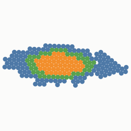
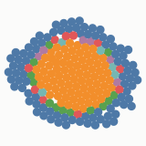
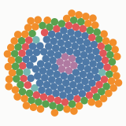
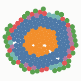
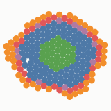
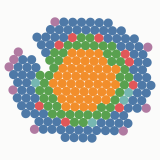
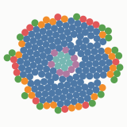
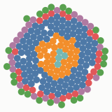
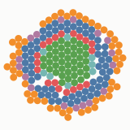

# M4: does segmentation or symmetry emerge without being selected for?

_Generated by `scripts/report.ts` from 16 runs in `reports/m4-data`._

## Setup

- 8 **selected** runs: fitness = mean of min(cells/200, 1) and min(cellTypes/6, 1). Nothing else is rewarded.
- 4 **drift** runs: identical except parents are chosen at random (no selection), as the null model.
- 4 **size-only** runs: selected for body size alone, a second null with viable organisms but no pressure on pattern.
- Each run: one random 8-gene founder (different per run index, same founder for selected-k and drift-k), population 32, 120 generations, elitism 2, tournament 3, default mutation rates (neutral duplication on).
- Development: {"gridNx":64,"gridNy":64,"maxCells":200,"tDev":150}; zygote polarity (1,0); default mechanics and noise.
- Criteria fixed before looking at the results (DESIGN.md D10):
  - **segmentation**: ≥ 3 regularly spaced stripes of one gene, each spanning ≥ 50% of the body width;
  - **non-trivial symmetry**: ≥ 3 cell types, ≥ 150 cells, and pattern symmetry (Cohen's κ, beyond chance) above the 99th percentile of unselected organisms with ≥ 3 types.

**Changes to the criteria, made after the experiment was launched (stated here so they can be judged):**

**(a) Null too small.** Only 90 organisms not selected for pattern (drift runs, size-only runs, and generation 0 of selected runs) had ≥ 3 types and ≥ 150 cells. Under drift, growth itself degrades, and selection for size alone rarely produces 3 types, so a 99th percentile of that set is **not meaningful**. Fallback: absolute thresholds κ > 0.5 (mirror or rotational).

**(b) Isotropy exclusion.** Chance-corrected κ does not exclude the trivial case DESIGN.md D10 warns about: concentric rings of cell types around the centre of a blob (an organism reading its own radial gradient) are mirror-symmetric about every axis and rotation-symmetric at every order. So a hit must also have *pattern isotropy* (κ under a 37° rotation) ≤ 0.3. The isotropy rule was added after seeing that segmentation never occurred and that the null was empty, but before looking at any κ values. Candidates were regrown with the current metric code to compute it. The *sampling* of candidates was then changed once: a trial on partial data checked the top 30 by κ, found them all isotropic, and that ranking would hide rarer non-isotropic patterns. So the final rule is a seeded random sample of up to 60 unique genomes per run.

**(c) Detector corrections after visual inspection.** The first report listed 10 "segmented" organisms (selected runs 4 and 7) and several symmetric ones. Looking at them showed both were detector artefacts. The "segments" were a broken outer rim: one gene on in the surface cells of a round organism, falling into three arcs that each passed the width test. The strongest "symmetries" in the control runs had a minority type of a few scattered cells, where κ is unstable because chance agreement is ≈ 1. Two fixes followed: stripes must cross the main axis and lie mostly in the interior, and pattern symmetry is only scored when the second type covers ≥ 10% of cells. Both have regression tests, one of them using the actual genome that fooled the first detector. All numbers below use the corrected detectors (candidates regrown).

## Results

| run | final best fitness | final best cells / types | max types ever | segmented (first detector → confirmed) | symmetric candidates (unique genomes) | of those isotropic (trivial) | non-trivially symmetric |
|---|---|---|---|---|---|---|---|
| selected 0 | 1.000 | 200 / 6 | 9 | 0 → 0 | 951 | 55 (of 60 sampled) | 5 |
| selected 1 | 1.000 | 200 / 6 | 12 | 0 → 0 | 2929 | 60 (of 60 sampled) | 0 |
| selected 2 | 1.000 | 200 / 6 | 8 | 0 → 0 | 2737 | 60 (of 60 sampled) | 0 |
| selected 3 | 0.917 | 200 / 5 | 5 | 0 → 0 | 1104 | 58 (of 60 sampled) | 0 |
| selected 4 | 1.000 | 200 / 6 | 10 | 4 → 0 | 2632 | 59 (of 60 sampled) | 0 |
| selected 5 | 1.000 | 200 / 6 | 7 | 0 → 0 | 2661 | 56 (of 60 sampled) | 0 |
| selected 6 | 1.000 | 200 / 6 | 11 | 0 → 0 | 2684 | 60 (of 60 sampled) | 0 |
| selected 7 | 1.000 | 200 / 6 | 10 | 6 → 0 | 2341 | 60 (of 60 sampled) | 0 |
| drift 0 | — | 1 / 1 | 2 | 0 → 0 | 0 | 0 | 0 |
| drift 1 | — | 1 / 1 | 3 | 0 → 0 | 25 | 20 | 0 |
| drift 2 | — | 0 / 0 | 2 | 0 → 0 | 0 | 0 | 0 |
| drift 3 | — | 1 / 1 | 2 | 0 → 0 | 0 | 0 | 0 |
| sizeonly 0 | 1.000 | 200 / 1 | 4 | 0 → 0 | 23 | 18 | 0 |
| sizeonly 1 | 1.000 | 200 / 2 | 4 | 0 → 0 | 34 | 33 | 0 |
| sizeonly 2 | 1.000 | 200 / 1 | 2 | 0 → 0 | 0 | 0 | 0 |
| sizeonly 3 | 1.000 | 200 / 1 | 3 | 0 → 0 | 5 | 5 | 0 |

**Runs in which segmentation appeared at least once:** selected 0/8, drift 0/4, size-only 0/4.

**Runs in which non-trivial symmetry appeared at least once:** selected 1/8, drift 0/4, size-only 0/4.

Organisms evaluated: 28816 in selected runs, 30024 not selected for pattern.

Among the 20280 selected-run organisms with ≥ 3 types and ≥ 150 cells: mirror κ median 0.70, 90th percentile 0.79; rotational κ median 0.55, 90th percentile 0.67.

### Did selection work on what it targeted?

| run | gen 0 mean types | final mean types | gen 0 mean cells | final mean cells |
|---|---|---|---|---|
| 0 | 1.00 | 6.34 | 48 | 190 |
| 1 | 1.84 | 6.78 | 194 | 200 |
| 2 | 1.00 | 5.94 | 200 | 194 |
| 3 | 1.00 | 4.28 | 200 | 194 |
| 4 | 0.97 | 6.63 | 188 | 194 |
| 5 | 1.00 | 6.06 | 200 | 200 |
| 6 | 1.00 | 5.81 | 189 | 200 |
| 7 | 0.97 | 5.34 | 17 | 194 |

## Examples and mechanisms

### selected run 0, individual 2624 (generation 87): symmetry

cells 200, types 3, segments 0, pattern mirror κ 0.75, rotational κ 0.21 (order 4), isotropy 0.21, elongation 3.06. Genome: 11 genes ([JSON](m4/genomes/selected-0-id2624.json)).

Knockout analysis (patternBilateral): the pattern is lost, while the organism still grows, when knocking out `g5` (morphogen). Knocking out `g0` stops growth (< 100 cells).

| knockout | type | patternBilateral | cells | types |
|---|---|---|---|---|
| g0 | effector/divide | 0.75 → 0.00 | 4 | 1 |
| g0' | effector/divide | 0.75 → 0.76 | 200 | 3 |
| g2 | tf | 0.75 → 0.73 | 200 | 3 |
| g3 | adhesion | 0.75 → 0.81 | 200 | 3 |
| g4 | tf | 0.75 → 0.93 | 200 | 2 |
| g4' | tf | 0.75 → 0.89 | 200 | 3 |
| g4'' | tf | 0.75 → 0.89 | 200 | 3 |
| g5 | morphogen | 0.75 → 0.00 | 200 | 1 |
| g6 | tf | 0.75 → 0.84 | 200 | 3 |
| g6' | tf | 0.75 → 0.79 | 200 | 3 |
| g7 | morphogen | 0.75 → 0.86 | 200 | 3 |

## Interpretation (written by hand after reading the results)

**Did segmentation or non-trivial symmetry arise without being selected for? Mostly, no.**

- **Segmentation: 0 of 8 selected runs and 0 of 8 control runs**, across ~59,000
  organisms. The only candidates were detector artefacts: broken outer rims
  (section (c) above). A segmentation clock (an oscillator plus a wavefront) or a
  Turing instability *along an elongating axis* would be needed, and selection for
  "more cell types" in a round 200-cell body never pushed in that direction within
  120 generations.
- **Symmetry is almost always the trivial kind.** Selection for cell types worked
  (7 of 8 runs reached the 6-type target). It did so by building **concentric
  zonation**: core, middle ring and rim, from each organism reading a gradient of a
  morphogen its own cells secrete. Of the symmetric candidates sampled in selected runs, 468 of 480 were isotropic;
  of the remaining 12, five (all from run 0) passed every criterion when regrown.
  In the controls, symmetric candidates were rare (87 unique genomes) and 76 of them
  were isotropic; none passed. The high pattern-symmetry scores (median mirror κ 0.70) are the
  free symmetry of a round body that DESIGN.md D10 warned about. The isotropy
  exclusion was needed to see this.
- **The one non-isotropic case (selected run 0) is the interesting result, but it is
  about shape, not pattern.** In five related genomes the organism elongates
  (elongation ≈ 3; 2.5–3.1 across noise seeds), and its type zones follow the
  elongated outline: mirror-symmetric about both axes, i.e. concentric zonation in a
  stretched body. It was never selected for shape. Knockouts give the mechanism:
  - elongation needs the **zygote polarity cue** (1.24 without it), so divisions
    follow the inherited maternal axis;
  - it needs morphogen **g7** (1.12 when knocked out). g7 is secreted by every cell and
    represses both divide effectors, so cells deep inside the tissue, where g7
    accumulates, divide more slowly. **Proliferation concentrates at the periphery
    and the tips, a growth zone produced by density sensing**;
  - it does not need the evolved asymmetric segregation of g4 (2.95 without).

  (Reproduce with `npx tsx scripts/ko-elongation.ts reports/m4/genomes/selected-0-id2624.json selected-0`.)

  M2 found that oriented division alone cannot elongate a growing tissue, because
  crowded chains buckle and cohesive tissue rounds up. Evolution found a route
  around this, combining oriented divisions with a growth zone, which is how real
  axes elongate. The genome also shows duplicate-then-diverge in action: g4 exists
  as three paralogs from two duplications, and its regulator g5 is the morphogen
  the type pattern depends on.

**What this says about the model, honestly**
- Within this budget (8 × 120 generations × 32 organisms, a 200-cell cap, selection
  only for size and type number), the model's evolutionary default is a radially
  zoned blob. Segmentation did not emerge.
- Drift alone destroys development: without selection, growth is lost within
  ~100 generations in every drift run. Selection for size alone rarely produces more
  than one cell type. Both controls had essentially no patterns at all.

**What would make emergence more likely (suggestions, not yet tested)**
1. Longer runs and larger populations. Run 0 needed ~100 generations just to leave a
   single cell type.
2. Selecting for something that rewards an axis (elongation, or type count *per
   unit body length*), so that segmentation becomes the cheapest way to add types.
3. Seeding runs with an oscillator (a repressilator module) or an elongating founder
   like run 0's, so a clock and a wavefront can meet.
4. Novelty search, which is implemented but was not used in this experiment.
5. Defining cell types over morphogen and adhesion genes as well (DESIGN.md §15
   open issue), which would let morphogen-only patterns count as types.

## Final organisms of the selected runs

 
 
 
 
 
 
 
 
